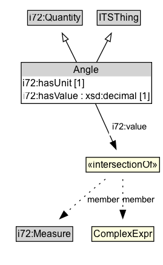

# Angle

An angle defined by two lines.

## Diagram

=== "SVG (interactive)"

    <!-- Generated by graphviz version 14.1.3 (20260303.0454)
     -->
    <!-- Pages: 1 -->
    <svg width="202pt" height="327pt"
     viewBox="0.00 0.00 202.00 327.00" xmlns="http://www.w3.org/2000/svg" xmlns:xlink="http://www.w3.org/1999/xlink">
    <g id="graph0" class="graph" transform="scale(1 1) rotate(0) translate(4 322.75)">
    <polygon fill="white" stroke="none" points="-4,4 -4,-322.75 197.5,-322.75 197.5,4 -4,4"/>
    <g id="clust3" class="cluster">
    <title>cluster_associated</title>
    </g>
    <!-- i72_Quantity -->
    <g id="node1" class="node">
    <title>i72_Quantity</title>
    <g id="a_node1"><a xlink:href="https://w3id.org/itsdata/i72/v1/Quantity" xlink:title="&lt;TABLE&gt;">
    <polygon fill="lightgray" stroke="none" points="31.12,-292.62 31.12,-308.88 96.88,-308.88 96.88,-292.62 31.12,-292.62"/>
    <text xml:space="preserve" text-anchor="start" x="32.12" y="-296.62" font-family="Arial" font-size="12.00">i72:Quantity</text>
    <polygon fill="none" stroke="black" points="30.12,-291.62 30.12,-309.88 97.88,-309.88 97.88,-291.62 30.12,-291.62"/>
    </a>
    </g>
    </g>
    <!-- ITSThing -->
    <g id="node2" class="node">
    <title>ITSThing</title>
    <g id="a_node2"><a xlink:href="../ITSThing" xlink:title="&lt;TABLE&gt;">
    <polygon fill="lightgray" stroke="none" points="117.25,-292.62 117.25,-308.88 168.75,-308.88 168.75,-292.62 117.25,-292.62"/>
    <text xml:space="preserve" text-anchor="start" x="118.25" y="-296.62" font-family="Arial" font-size="12.00">ITSThing</text>
    <polygon fill="none" stroke="black" points="116.25,-291.62 116.25,-309.88 169.75,-309.88 169.75,-291.62 116.25,-291.62"/>
    </a>
    </g>
    </g>
    <!-- Angle -->
    <g id="node3" class="node">
    <title>Angle</title>
    <g id="a_node3"><a xlink:href="../Angle" xlink:title="&lt;TABLE&gt;">
    <polygon fill="lightgray" stroke="none" points="23.25,-228.5 23.25,-244.75 182.75,-244.75 182.75,-228.5 23.25,-228.5"/>
    <text xml:space="preserve" text-anchor="start" x="87.25" y="-232.5" font-family="Arial" font-size="12.00">Angle</text>
    <text xml:space="preserve" text-anchor="start" x="24.25" y="-216.25" font-family="Arial" font-size="12.00">i72:hasUnit [1]</text>
    <text xml:space="preserve" text-anchor="start" x="24.25" y="-200" font-family="Arial" font-size="12.00">i72:hasValue : xsd:decimal [1]</text>
    <polygon fill="none" stroke="black" points="22.25,-195 22.25,-245.75 183.75,-245.75 183.75,-195 22.25,-195"/>
    </a>
    </g>
    </g>
    <!-- Angle&#45;&gt;i72_Quantity -->
    <g id="edge1" class="edge">
    <title>Angle&#45;&gt;i72_Quantity</title>
    <path fill="none" stroke="black" d="M90.89,-245.71C86.59,-254.35 81.73,-264.12 77.33,-272.96"/>
    <polygon fill="none" stroke="black" points="74.27,-271.26 72.95,-281.77 80.53,-274.38 74.27,-271.26"/>
    </g>
    <!-- Angle&#45;&gt;ITSThing -->
    <g id="edge2" class="edge">
    <title>Angle&#45;&gt;ITSThing</title>
    <path fill="none" stroke="black" d="M115.42,-245.71C119.83,-254.35 124.82,-264.12 129.33,-272.96"/>
    <polygon fill="none" stroke="black" points="126.17,-274.46 133.83,-281.78 132.4,-271.28 126.17,-274.46"/>
    </g>
    <!-- Invis -->
    <!-- Angle&#45;&gt;Invis -->
    <!-- ndc68c3ddb8a24710a1c0c38a2a6085beb2 -->
    <g id="node6" class="node">
    <title>ndc68c3ddb8a24710a1c0c38a2a6085beb2</title>
    <polygon fill="lightyellow" stroke="none" points="102.5,-110.38 102.5,-128.62 193.5,-128.62 193.5,-110.38 102.5,-110.38"/>
    <text xml:space="preserve" text-anchor="start" x="104.5" y="-115.38" font-family="Arial" font-size="12.00">«intersectionOf»</text>
    <polygon fill="none" stroke="black" points="102.5,-110.38 102.5,-128.62 193.5,-128.62 193.5,-110.38 102.5,-110.38"/>
    </g>
    <!-- Angle&#45;&gt;ndc68c3ddb8a24710a1c0c38a2a6085beb2 -->
    <g id="edge7" class="edge">
    <title>Angle&#45;&gt;ndc68c3ddb8a24710a1c0c38a2a6085beb2</title>
    <path fill="none" stroke="black" d="M114.01,-195.19C120.58,-180.74 128.95,-162.36 135.73,-147.45"/>
    <polygon fill="black" stroke="black" points="138.76,-149.24 139.72,-138.69 132.39,-146.35 138.76,-149.24"/>
    <polygon fill="white" stroke="none" points="130.85,-155.5 130.85,-177 181.6,-177 181.6,-155.5 130.85,-155.5"/>
    <text xml:space="preserve" text-anchor="start" x="134.85" y="-162.5" font-family="Arial" font-size="11.00">i72:value</text>
    </g>
    <!-- i72_Measure -->
    <g id="node5" class="node">
    <title>i72_Measure</title>
    <g id="a_node5"><a xlink:href="https://w3id.org/itsdata/i72/v1/Measure" xlink:title="&lt;TABLE&gt;">
    <polygon fill="lightgray" stroke="none" points="17,-25.88 17,-42.12 85,-42.12 85,-25.88 17,-25.88"/>
    <text xml:space="preserve" text-anchor="start" x="18" y="-29.88" font-family="Arial" font-size="12.00">i72:Measure</text>
    <polygon fill="none" stroke="black" points="16,-24.88 16,-43.12 86,-43.12 86,-24.88 16,-24.88"/>
    </a>
    </g>
    </g>
    <!-- Invis&#45;&gt;i72_Measure -->
    <!-- ndc68c3ddb8a24710a1c0c38a2a6085beb2&#45;&gt;i72_Measure -->
    <g id="edge5" class="edge">
    <title>ndc68c3ddb8a24710a1c0c38a2a6085beb2&#45;&gt;i72_Measure</title>
    <path fill="none" stroke="black" stroke-dasharray="1,5" d="M126.41,-101.68C119.28,-96 111.35,-89.56 104.25,-83.5 95.36,-75.91 85.86,-67.39 77.38,-59.64"/>
    <polygon fill="black" stroke="black" points="79.82,-57.13 70.09,-52.93 75.08,-62.28 79.82,-57.13"/>
    <text xml:space="preserve" text-anchor="middle" x="124.12" y="-73.05" font-family="Arial" font-size="11.00">member</text>
    </g>
    <!-- ndc68c3ddb8a24710a1c0c38a2a6085beb3 -->
    <g id="node7" class="node">
    <title>ndc68c3ddb8a24710a1c0c38a2a6085beb3</title>
    <polygon fill="lightyellow" stroke="none" points="109.62,-24.88 109.62,-43.12 186.38,-43.12 186.38,-24.88 109.62,-24.88"/>
    <text xml:space="preserve" text-anchor="start" x="111.62" y="-29.88" font-family="Arial" font-size="12.00">ComplexExpr</text>
    <polygon fill="none" stroke="black" points="109.62,-24.88 109.62,-43.12 186.38,-43.12 186.38,-24.88 109.62,-24.88"/>
    </g>
    <!-- ndc68c3ddb8a24710a1c0c38a2a6085beb2&#45;&gt;ndc68c3ddb8a24710a1c0c38a2a6085beb3 -->
    <g id="edge6" class="edge">
    <title>ndc68c3ddb8a24710a1c0c38a2a6085beb2&#45;&gt;ndc68c3ddb8a24710a1c0c38a2a6085beb3</title>
    <path fill="none" stroke="black" stroke-dasharray="1,5" d="M148,-101.6C148,-90.62 148,-76.04 148,-63.32"/>
    <polygon fill="black" stroke="black" points="151.5,-63.39 148,-53.39 144.5,-63.39 151.5,-63.39"/>
    <text xml:space="preserve" text-anchor="middle" x="167.88" y="-73.05" font-family="Arial" font-size="11.00">member</text>
    </g>
    </g>
    </svg>

=== "PNG"

    

## Specializations of Angle

| Class | Description |
|-------|-------------|
| [Bearing](Bearing.md) | The orientation of a line or movement, measured from north (0°) clockwise. |

## Formalization for Angle

| Property | Constraint |
|----------|------------|
| [i72:hasUnit](https://w3id.org/itsdata/i72/v1/hasUnit) | exactly 1 [AngleUnit](https://w3id.org/itsdata/core/v1/AngleUnit) |
| [i72:hasValue](https://w3id.org/itsdata/i72/v1/hasValue) | exactly 1 xsd:decimal |
| [i72:value](https://w3id.org/itsdata/i72/v1/value) | only ComplexExpr and [i72:Measure](https://w3id.org/itsdata/i72/v1/Measure) |
| subClassOf | [ITSThing](ITSThing.md) |
| subClassOf | [i72:Quantity](https://w3id.org/itsdata/i72/v1/Quantity) |

