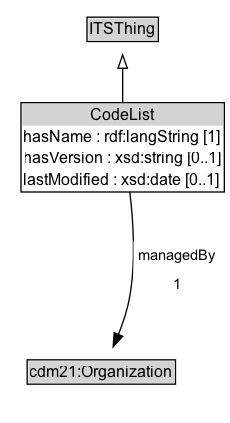

# CodeList

A curated set of codes (a code list), typically maintained and versioned by some entity.

## Diagram

=== "SVG (interactive)"

    <!-- Generated by graphviz version 14.1.3 (20260303.0454)
     -->
    <!-- Pages: 1 -->
    <svg width="172pt" height="317pt"
     viewBox="0.00 0.00 172.00 317.00" xmlns="http://www.w3.org/2000/svg" xmlns:xlink="http://www.w3.org/1999/xlink">
    <g id="graph0" class="graph" transform="scale(1 1) rotate(0) translate(4 313)">
    <polygon fill="white" stroke="none" points="-4,4 -4,-313 168.25,-313 168.25,4 -4,4"/>
    <g id="clust3" class="cluster">
    <title>cluster_associated</title>
    </g>
    <!-- ITSThing -->
    <g id="node1" class="node">
    <title>ITSThing</title>
    <g id="a_node1"><a xlink:href="../ITSThing" xlink:title="&lt;TABLE&gt;">
    <polygon fill="lightgray" stroke="none" points="62.25,-282.88 62.25,-299.12 113.75,-299.12 113.75,-282.88 62.25,-282.88"/>
    <text xml:space="preserve" text-anchor="start" x="63.25" y="-286.88" font-family="Arial" font-size="12.00">ITSThing</text>
    <polygon fill="none" stroke="black" points="61.25,-281.88 61.25,-300.12 114.75,-300.12 114.75,-281.88 61.25,-281.88"/>
    </a>
    </g>
    </g>
    <!-- CodeList -->
    <g id="node2" class="node">
    <title>CodeList</title>
    <g id="a_node2"><a xlink:href="../CodeList" xlink:title="&lt;TABLE&gt;">
    <polygon fill="lightgray" stroke="none" points="12.75,-218.75 12.75,-235 163.25,-235 163.25,-218.75 12.75,-218.75"/>
    <text xml:space="preserve" text-anchor="start" x="64" y="-222.75" font-family="Arial" font-size="12.00">CodeList</text>
    <text xml:space="preserve" text-anchor="start" x="13.75" y="-206.5" font-family="Arial" font-size="12.00">hasName : rdf:langString [1]</text>
    <text xml:space="preserve" text-anchor="start" x="13.75" y="-190.25" font-family="Arial" font-size="12.00">hasVersion : xsd:string [0..1]</text>
    <text xml:space="preserve" text-anchor="start" x="13.75" y="-174" font-family="Arial" font-size="12.00">lastModified : xsd:date [0..1]</text>
    <polygon fill="none" stroke="black" points="11.75,-169 11.75,-236 164.25,-236 164.25,-169 11.75,-169"/>
    </a>
    </g>
    </g>
    <!-- CodeList&#45;&gt;ITSThing -->
    <g id="edge1" class="edge">
    <title>CodeList&#45;&gt;ITSThing</title>
    <path fill="none" stroke="black" d="M88,-235.89C88,-244.45 88,-253.62 88,-261.93"/>
    <polygon fill="none" stroke="black" points="84.5,-261.81 88,-271.81 91.5,-261.81 84.5,-261.81"/>
    </g>
    <!-- Invis -->
    <!-- CodeList&#45;&gt;Invis -->
    <!-- cdm21_Organization -->
    <g id="node4" class="node">
    <title>cdm21_Organization</title>
    <g id="a_node4"><a xlink:href="https://w3id.org/citydata/imported/cdm21/latest/Organization" xlink:title="&lt;TABLE&gt;">
    <polygon fill="lightgray" stroke="none" points="17.38,-25.88 17.38,-42.12 126.62,-42.12 126.62,-25.88 17.38,-25.88"/>
    <text xml:space="preserve" text-anchor="start" x="18.38" y="-29.88" font-family="Arial" font-size="12.00">cdm21:Organization</text>
    <polygon fill="none" stroke="black" points="16.38,-24.88 16.38,-43.12 127.62,-43.12 127.62,-24.88 16.38,-24.88"/>
    </a>
    </g>
    </g>
    <!-- CodeList&#45;&gt;cdm21_Organization -->
    <g id="edge4" class="edge">
    <title>CodeList&#45;&gt;cdm21_Organization</title>
    <path fill="none" stroke="black" d="M93.32,-169.22C96.11,-146.58 98.01,-115.71 93,-89 91.3,-79.93 88.12,-70.42 84.74,-61.95"/>
    <polygon fill="black" stroke="black" points="88.03,-60.76 80.88,-52.94 81.6,-63.51 88.03,-60.76"/>
    <polygon fill="white" stroke="none" points="96.11,-89 96.11,-132 161.86,-132 161.86,-89 96.11,-89"/>
    <text xml:space="preserve" text-anchor="start" x="100.11" y="-117.5" font-family="Arial" font-size="11.00">managedBy</text>
    <text xml:space="preserve" text-anchor="start" x="125.99" y="-96" font-family="Arial" font-size="11.00">1</text>
    </g>
    <!-- Invis&#45;&gt;cdm21_Organization -->
    </g>
    </svg>

=== "PNG"

    

## Formalization for CodeList

| Property | Constraint |
|----------|------------|
| [hasName](../properties/hasName.md) | exactly 1 rdf:langString |
| [hasVersion](../properties/hasVersion.md) | max 1 xsd:string |
| [lastModified](../properties/lastModified.md) | max 1 xsd:date |
| [managedBy](../properties/managedBy.md) | exactly 1 [cdm21:Organization](https://w3id.org/cdm2/v1/Organization) |
| subClassOf | [ITSThing](ITSThing.md) |

