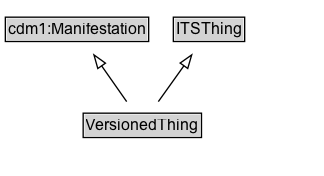

# VersionedThing

An identifiable version of a managed object.

## Diagram

=== "SVG (interactive)"

    <!-- Generated by graphviz version 14.1.3 (20260303.0454)
     -->
    <!-- Pages: 1 -->
    <svg width="243pt" height="132pt"
     viewBox="0.00 0.00 243.00 132.00" xmlns="http://www.w3.org/2000/svg" xmlns:xlink="http://www.w3.org/1999/xlink">
    <g id="graph0" class="graph" transform="scale(1 1) rotate(0) translate(4 128)">
    <polygon fill="white" stroke="none" points="-4,4 -4,-128 238.75,-128 238.75,4 -4,4"/>
    <g id="clust3" class="cluster">
    <title>cluster_associated</title>
    </g>
    <!-- cdm1_Manifestation -->
    <g id="node1" class="node">
    <title>cdm1_Manifestation</title>
    <g id="a_node1"><a xlink:href="https://w3id.org/citydata/part1/v1/Manifestation" xlink:title="&lt;TABLE&gt;">
    <polygon fill="lightgray" stroke="none" points="1,-97.88 1,-114.12 106.5,-114.12 106.5,-97.88 1,-97.88"/>
    <text xml:space="preserve" text-anchor="start" x="2" y="-101.88" font-family="Arial" font-size="12.00">cdm1:Manifestation</text>
    <polygon fill="none" stroke="black" points="0,-96.88 0,-115.12 107.5,-115.12 107.5,-96.88 0,-96.88"/>
    </a>
    </g>
    </g>
    <!-- ITSThing -->
    <g id="node2" class="node">
    <title>ITSThing</title>
    <g id="a_node2"><a xlink:href="../ITSThing" xlink:title="&lt;TABLE&gt;">
    <polygon fill="lightgray" stroke="none" points="127,-97.88 127,-114.12 178.5,-114.12 178.5,-97.88 127,-97.88"/>
    <text xml:space="preserve" text-anchor="start" x="128" y="-101.88" font-family="Arial" font-size="12.00">ITSThing</text>
    <polygon fill="none" stroke="black" points="126,-96.88 126,-115.12 179.5,-115.12 179.5,-96.88 126,-96.88"/>
    </a>
    </g>
    </g>
    <!-- VersionedThing -->
    <g id="node3" class="node">
    <title>VersionedThing</title>
    <g id="a_node3"><a xlink:href="../VersionedThing" xlink:title="&lt;TABLE&gt;">
    <polygon fill="lightgray" stroke="none" points="59.38,-25.88 59.38,-42.12 146.12,-42.12 146.12,-25.88 59.38,-25.88"/>
    <text xml:space="preserve" text-anchor="start" x="60.38" y="-29.88" font-family="Arial" font-size="12.00">VersionedThing</text>
    <polygon fill="none" stroke="black" points="58.38,-24.88 58.38,-43.12 147.12,-43.12 147.12,-24.88 58.38,-24.88"/>
    </a>
    </g>
    </g>
    <!-- VersionedThing&#45;&gt;cdm1_Manifestation -->
    <g id="edge1" class="edge">
    <title>VersionedThing&#45;&gt;cdm1_Manifestation</title>
    <path fill="none" stroke="black" d="M91,-51.79C85.36,-59.85 78.46,-69.69 72.15,-78.71"/>
    <polygon fill="none" stroke="black" points="69.35,-76.62 66.48,-86.82 75.08,-80.63 69.35,-76.62"/>
    </g>
    <!-- VersionedThing&#45;&gt;ITSThing -->
    <g id="edge2" class="edge">
    <title>VersionedThing&#45;&gt;ITSThing</title>
    <path fill="none" stroke="black" d="M114.74,-51.79C120.5,-59.85 127.53,-69.69 133.97,-78.71"/>
    <polygon fill="none" stroke="black" points="131.11,-80.72 139.77,-86.82 136.8,-76.65 131.11,-80.72"/>
    </g>
    <!-- Invis -->
    </g>
    </svg>

=== "PNG"

    

## Formalization for VersionedThing

| Property | Constraint |
|----------|------------|
| [cdm1:hasVersion](https://w3id.org/citydata/part1/v1/hasVersion) | exactly 1 |
| subClassOf | [ITSThing](ITSThing.md) |
| subClassOf | [cdm1:Manifestation](https://w3id.org/citydata/part1/v1/Manifestation) |

